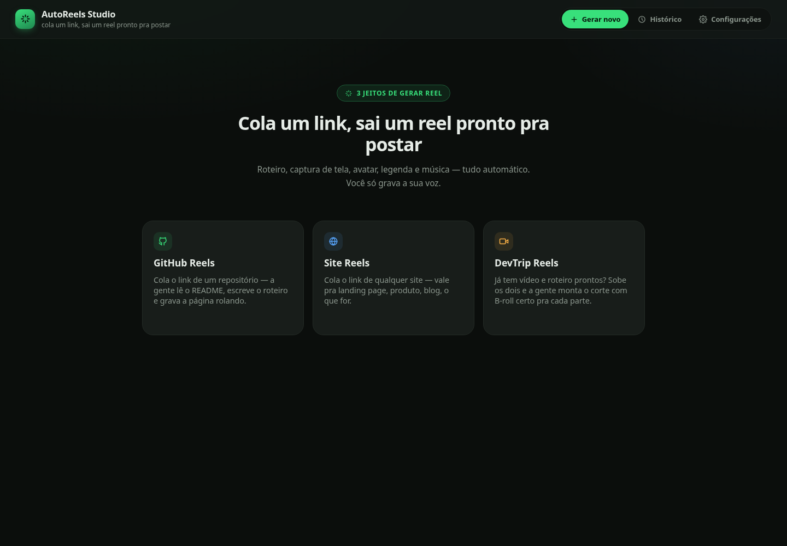
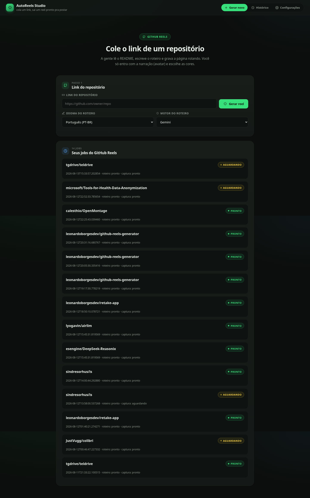
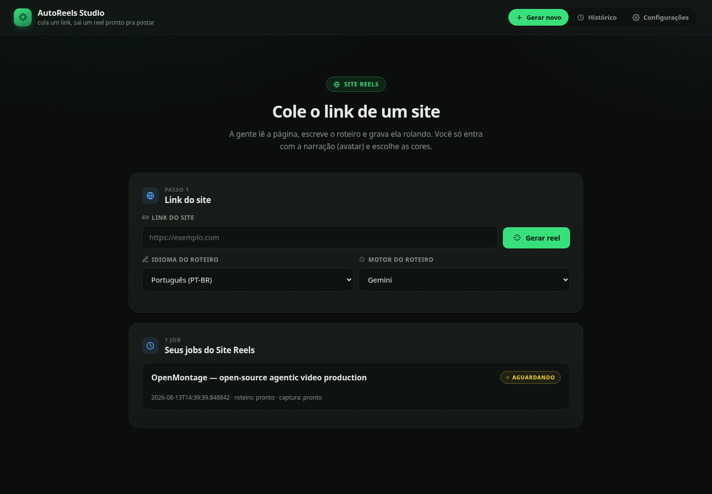
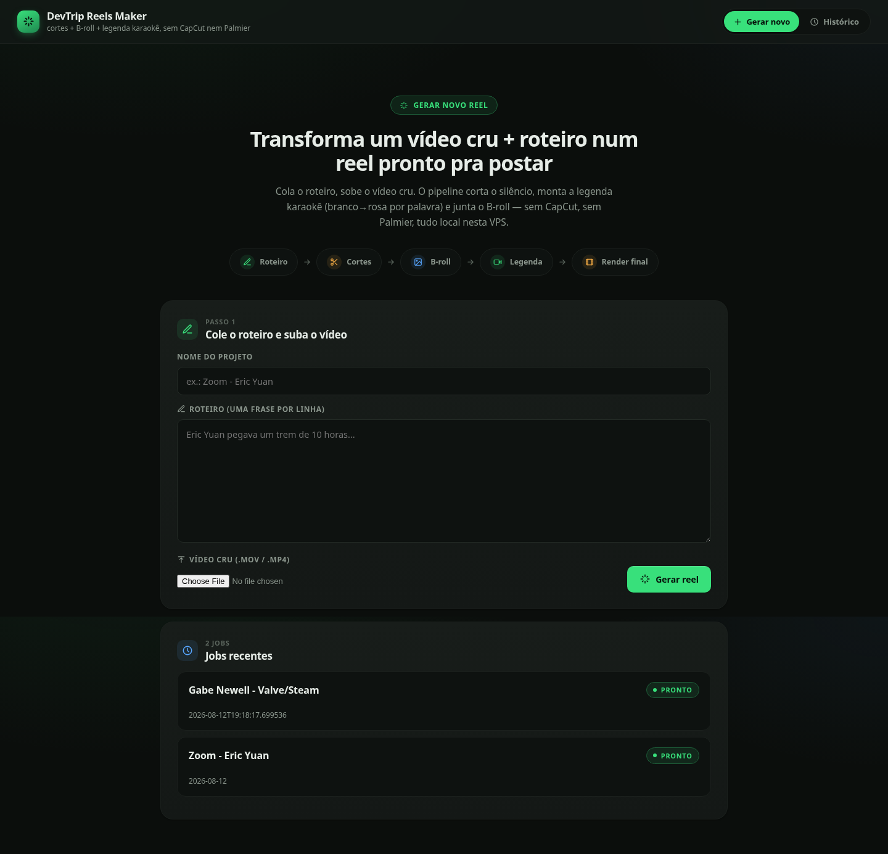
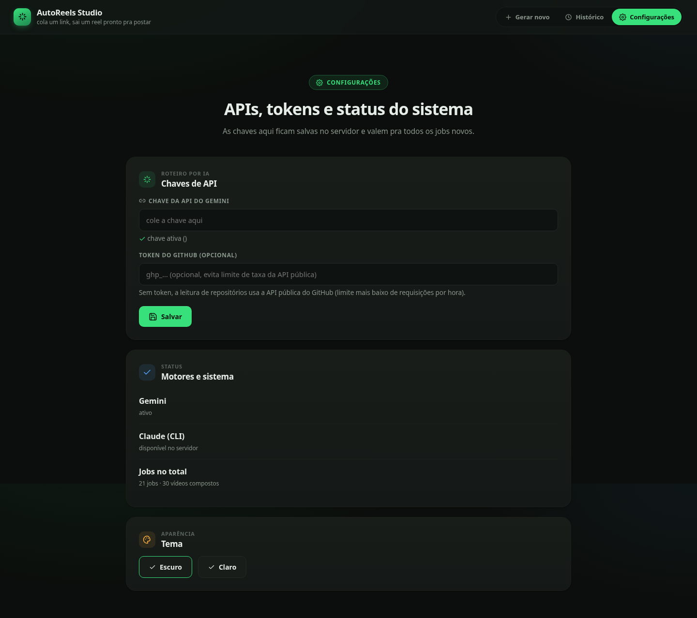

# AutoReels Studio

[](LICENSE) [](#)

**Cola um link — repositório do GitHub, qualquer site, ou seu próprio vídeo — e sai um reel vertical pronto pra postar: roteiro escrito por IA, captura de tela automática, avatar clonado, legenda estilo karaokê e música de fundo.**



## Por quê

Fazer um reel decente é repetitivo: ler o material, escrever um roteiro que não pareça anúncio, gravar/editar, sincronizar a narração, cortar, legendar. O AutoReels Studio automatiza tudo isso menos a parte que só um humano pode fazer — gravar a própria voz/rosto (clonados via avatar) lendo o roteiro. O resto roda sozinho.

## As 3 funções

- **GitHub Reels** — cola o link de um repositório, a IA lê o README e escreve um roteiro em PT-BR (ou outro idioma), enquanto já grava a tela rolando o repositório em segundo plano.
- **Site Reels** — mesma coisa, mas pra qualquer site: landing page, produto, blog. Não precisa ser GitHub.
- **DevTrip Reels** — já tem vídeo cru e roteiro prontos? Sobe os dois e o pipeline corta o silêncio, busca e monta o B-roll certo pra cada trecho do roteiro, com legenda karaokê — sem precisar do CapCut.

Em todas, depois é só subir o vídeo do avatar (clonado num serviço tipo HeyGen), escolher a paleta de cores e a música, e a composição final roda via ffmpeg no servidor.

## Como funciona (visão geral)

```
GitHub Reels  ──┐
Site Reels    ──┼─ roteiro (IA) + captura de tela (Playwright) ──┐
                │                                                 ├─ ffmpeg → vídeo final → legenda/DM (IA)
DevTrip Reels ──┴─ vídeo cru + roteiro → cortes + B-roll ─────────┘
                                          avatar (upload manual)
```

Um único domínio serve as 3 funções. GitHub Reels e Site Reels rodam no mesmo processo Flask (`dashboard/app.py`); DevTrip Reels é um segundo app Flask, com processo e dependências próprias, montado sob `/devtrip` no mesmo domínio via [`werkzeug.middleware.dispatcher.DispatcherMiddleware`](https://werkzeug.palletsprojects.com/en/stable/middleware/dispatcher/) — sem misturar as duas bases de código, sem subdomínio separado.

## Features

- **Roteiro por IA** — Gemini ou Claude (você escolhe o motor a cada job, com fallback heurístico se os dois falharem), em PT-BR ou inglês
- **Captura de tela automática** — Playwright rola a página sozinho e grava em 1080×1920, com timing calibrado pra não travar/pular (ver [nota técnica](#nota-técnica-captura-de-tela-sem-travar) abaixo)
- **Avatar circular com moldura animada** — detecção de rosto (OpenCV) recorta e centraliza automaticamente o avatar clonado, com anel decorativo girando e cutaways em tela cheia nos momentos certos
- **Legenda estilo karaokê** — transcrição palavra-a-palavra (faster-whisper) vira legenda `.ass` com a palavra atual destacada em cor, sincronizada por timestamp
- **Paleta de cores customizável** — anel, borda giratória, fundo do texto e cor do destaque da legenda, gerados por job
- **Música de fundo opcional** — mixada por baixo da voz sem re-balancear o volume já calibrado (loudnorm de dois passes)
- **Legenda do post + DM automática** — depois do vídeo pronto, um segundo passe de IA já escreve o texto pronto pra colar no Instagram e a mensagem de DM automática
- **Tema claro/escuro** — configurável, salvo no navegador
- **Histórico** — todas as versões renderizadas de cada job, com as cores usadas em cada uma

## Screenshots

**Tela inicial** — as 3 funções, cada uma com sua própria tela:


**GitHub Reels** — cola o link do repositório, acompanha os jobs recentes:



**Site Reels** — mesmo fluxo, pra qualquer site:



**DevTrip Reels** — sobe vídeo cru + roteiro, o pipeline monta o corte com B-roll:



**Histórico** — todos os vídeos já compostos, com download:


**Configurações** — chaves de API e tema claro/escuro:



## Tech Stack

- Python / Flask + gunicorn
- ffmpeg (composição, mixagem, ASS burn-in)
- faster-whisper (transcrição palavra-a-palavra)
- OpenCV (detecção de rosto)
- Playwright (captura de tela automática)
- Gemini / Claude (roteiro e legenda do post via IA, com fallback heurístico)
- Cloudflare Tunnel com roteamento por caminho (`path`) pra servir múltiplos apps Flask independentes sob o mesmo domínio

## Setup

```bash
git clone https://github.com/leonardoborgesdev/autoreels-studio.git
cd autoreels-studio
python3 -m venv venv
venv/bin/pip install -r requirements.txt
venv/bin/playwright install chromium
```

Variáveis de ambiente (opcionais — sem elas, cai no fallback heurístico de roteiro, ou configure pela própria tela de Configurações do app):

```bash
export GEMINI_API_KEY=your_key_here
```

Rodar a dashboard:

```bash
cd dashboard
../venv/bin/python3 app.py          # dev, porta 8099
# ou, em produção:
../venv/bin/gunicorn --workers 1 --threads 8 --timeout 600 --bind 0.0.0.0:8099 app:app
```

Composição direta pela linha de comando (sem a dashboard):

```bash
venv/bin/python3 pipeline_remoto.py fundo.mp4 avatar.mp4 nome_saida \
  --caption-color "#9333EA" --mode capture
```

## Nota técnica: captura de tela sem travar

A captura de tela (rolagem automática via Playwright) já passou por vários problemas clássicos de automação headless — documentados aqui pra quem for debugar algo parecido:

**Causa raiz real de travamentos/saltos**: o Chromium aplica throttling interno de timers (`setTimeout`/`requestAnimationFrame`) em páginas que ele classifica como "em segundo plano" — o que uma página headless do Playwright sempre é, mesmo sem trocar de aba de verdade. Um override de `document.hidden` via JavaScript **não resolve**, porque essa decisão acontece num nível mais interno do navegador. Fix real, em `scroll_capture.py`:

```python
browser = p.chromium.launch(
    headless=True,
    args=[
        "--disable-background-timer-throttling",
        "--disable-backgrounding-occluded-windows",
        "--disable-renderer-backgrounding",
        "--disable-ipc-flooding-protection",
    ],
)
```

Camadas extras que ficaram no código (defesa em profundidade contra outras causas de trava de thread principal, como decode de imagem pesada):
- Espera de `img.decode()` com `loading="eager"` forçado antes de começar a rolagem cronometrada.
- Passada de "aquecimento" (rola até o fim e volta, fora do vídeo final) pra forçar layout/pintura de cada trecho da página uma vez antes da gravação de verdade.
- Rolagem **sem prazo fixo**: em vez de forçar terminar numa duração exata, rola num ritmo constante e deixa levar o tempo real que precisar — a composição final já corta/estica o fundo pra bater com a duração real da narração, então não há necessidade de um tempo de captura exato. Só com um teto de segurança pra nunca rodar indefinidamente.
- Exportação final em CFR (frame rate constante) em vez de VFR — um vídeo de frame rate variável pode parecer correto quando extraído frame a frame, mas trava/pula na reprodução real do `<video>` do navegador.
- Corte de início preciso por marcador visual (flash de cor sólida, detectado por análise de cor média do frame) em vez de medir tempo de parede em Python.

## Limitações conhecidas

- Legenda, posição/tamanho do avatar e quantidade de cortes em tela cheia ainda não são customizáveis pela interface (fixos no código do pipeline) — no roadmap.
- DevTrip Reels depende de upload manual do vídeo cru + roteiro linha a linha; não gera o vídeo do zero.

## License

Todos os direitos reservados — uso e redistribuição não autorizados.
