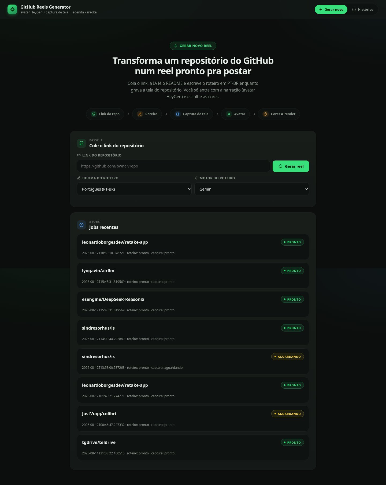
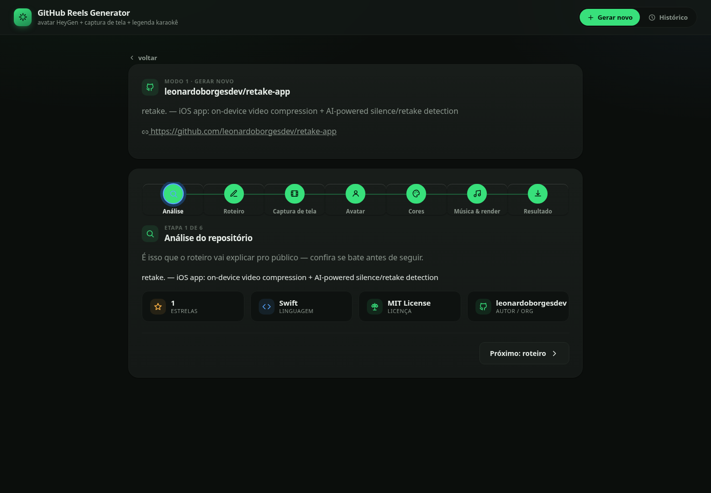
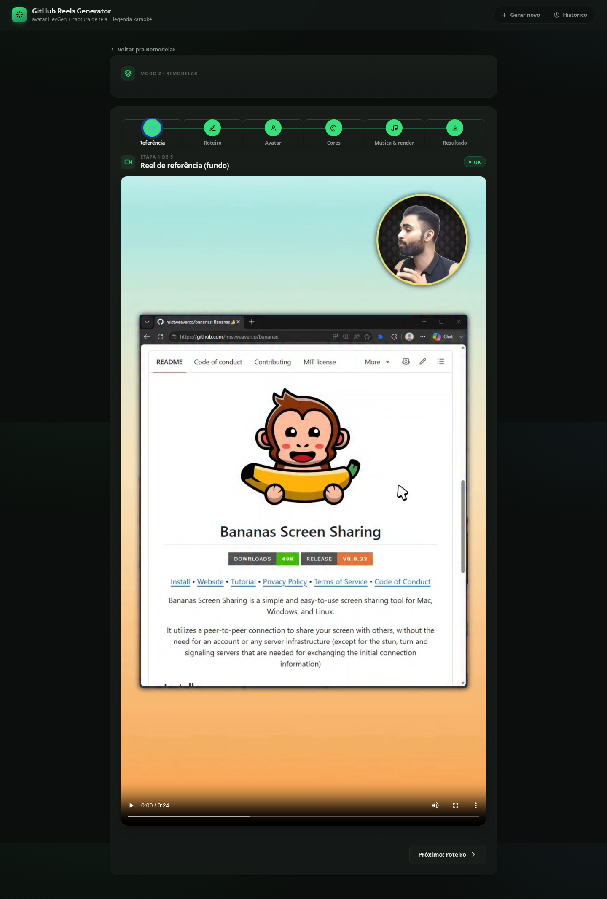
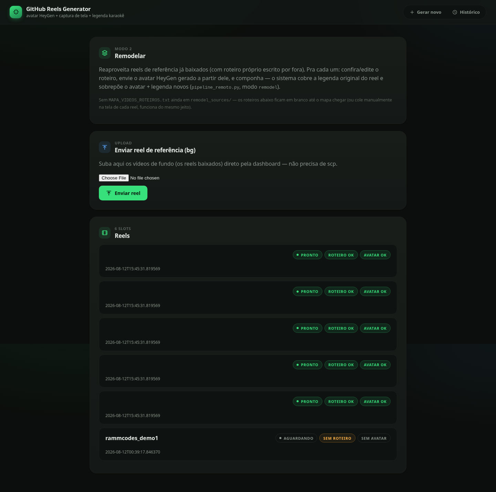
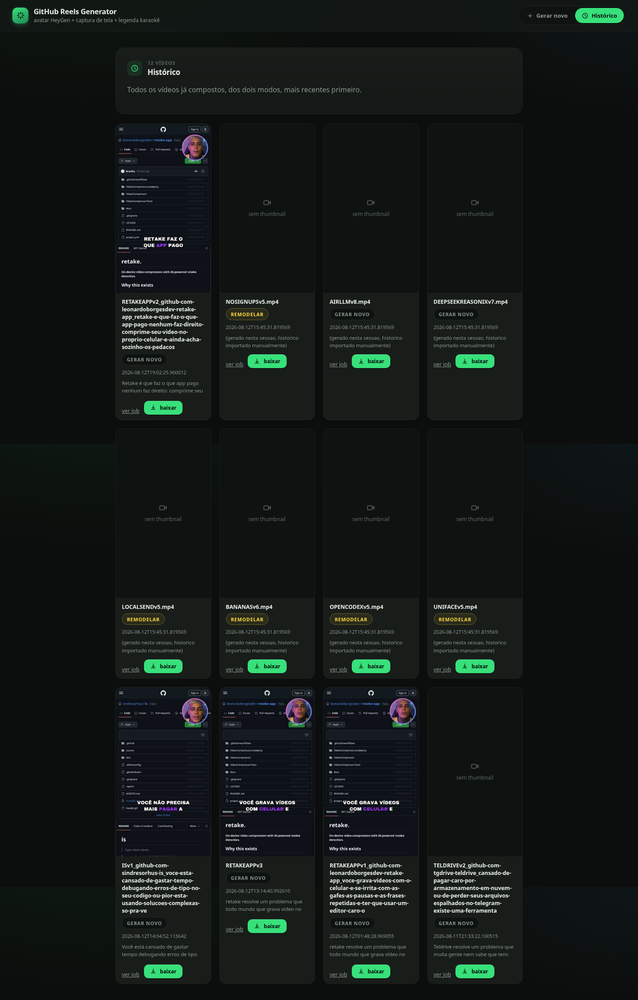

# GitHub Reels Generator

**Cola o link de um repositório do GitHub, sai um reel vertical pronto pra postar — roteiro escrito por IA, captura de tela automática, avatar clonado, legenda karaokê e música de fundo.**



## Por quê

Divulgar projetos open source em reels/shorts é repetitivo: ler o README, escrever um roteiro que não pareça anúncio, gravar a tela rolando o repositório, sincronizar a narração com a captura, cortar, legendar. Essa dashboard automatiza tudo isso menos a parte que só um humano pode fazer — gravar a própria voz/rosto (clonados via avatar) lendo o roteiro. O resto (ler o repo, escrever, gravar tela, compor vídeo, gerar legenda + copy pro post) roda sozinho.

Dois modos:

- **Gerar novo** — cola o link do repo, a IA lê a descrição + README e escreve um roteiro em PT-BR (ou outro idioma), enquanto já dispara a gravação automática da tela rolando o repositório em segundo plano.
- **Remodelar** — reaproveita um reel de referência já baixado (de qualquer conta), sobe só o avatar com um roteiro próprio e recompõe por cima, cobrindo a legenda original.

Em ambos, depois é só subir o vídeo do avatar (clonado num serviço tipo HeyGen), escolher a paleta de cores e música, e a composição final (círculo do avatar com moldura girando, cutaways em tela cheia, legenda estilo karaokê palavra-a-palavra, mixagem de áudio com loudnorm em dois passes) roda via ffmpeg no servidor.

## Features

- **Roteiro por IA** — Gemini ou Claude (você escolhe o motor a cada job, com fallback heurístico se os dois falharem), em PT-BR ou inglês, lendo descrição + README real do repositório via API do GitHub
- **Captura de tela automática** — Playwright rola a página do repositório sozinho (README, código, gráficos) e grava em 1080×1920
- **Avatar circular com moldura animada** — detecção de rosto (OpenCV) recorta e centraliza automaticamente o avatar clonado, com anel decorativo girando (`hue` rotation no ffmpeg) e cutaways em tela cheia nos momentos certos
- **Legenda estilo karaokê** — transcrição palavra-a-palavra (faster-whisper) vira legenda `.ass` com a palavra atual destacada em cor, sincronizada por timestamp
- **Paleta de cores customizável** — anel, borda giratória, fundo do texto e cor do destaque da legenda, gerados por job (`colorize.py`)
- **Música de fundo opcional** — mixada por baixo da voz sem re-balancear o volume já calibrado (loudnorm de dois passes, sem o "bombeamento" do modo adaptativo de passe único)
- **Legenda do post + DM automática** — depois do vídeo pronto, um segundo passe de IA já escreve o texto pronto pra colar no Instagram (mesmo padrão de formato aprovado manualmente) e a mensagem de DM automática
- **Abrir no editor (FreeCut)** — a partir do vídeo final, um botão gera um projeto do [FreeCut](https://github.com/walterlow/freecut) (editor de vídeo 100% no navegador, self-hosted) já com o círculo do avatar, a legenda e a música na posição exata da composição, pronto pra ajustar arrastando — ver [`freecut-integration/`](freecut-integration/)
- **Histórico** — todas as versões renderizadas de cada job, com as cores usadas em cada uma

## Como funciona (visão geral)

```
link do repo → roteiro (IA)  ──┐
                                 ├─ pipeline_remoto.py (ffmpeg) → vídeo final → legenda/DM (IA)
captura de tela (Playwright) ──┤
avatar (upload manual)       ──┘
```

A dashboard (Flask) guarda o estado de cada job em disco (`dashboard/jobs/<id>/state.json`) e dispara as etapas pesadas (captura de tela, composição ffmpeg, chamadas de IA) em threads separadas, com log em tempo real na própria página. `pipeline_remoto.py` é o núcleo: detecta o rosto no vídeo do avatar, cacheia a transcrição por avatar (`words_cache.json`) pra recompor rápido quando só a cor muda, e monta o filtro complexo do ffmpeg (fundo + avatar recortado em círculo + moldura + legenda `.ass` + música).

## Screenshots

**Tela inicial** — cola o link, escolhe idioma e motor de IA (Gemini ou Claude), acompanha os jobs recentes:


**Wizard de 7 etapas** (Análise → Roteiro → Captura de tela → Avatar → Cores → Música & render → Resultado) — cada fase confirma o que a IA leu antes de seguir:



**Modo Remodelar** — reaproveita um reel de referência, mostra o preview exato de como o avatar novo vai cobrir o original antes de compor:



**Slots do modo Remodelar** — status de roteiro/avatar por reel, upload direto pela dashboard (sem `scp`):



**Histórico** — todos os vídeos já compostos, dos dois modos, com download e "abrir no editor" (FreeCut) direto do card:



## Tech Stack

- Python / Flask + gunicorn
- ffmpeg (composição, mixagem, ASS burn-in)
- faster-whisper (transcrição palavra-a-palavra)
- OpenCV (detecção de rosto)
- Playwright (captura de tela automática do repositório)
- Gemini / Claude (roteiro e legenda do post via IA, com fallback heurístico)
- [FreeCut](https://github.com/walterlow/freecut) (React + WebCodecs/WebGPU) para o editor visual opcional

## Setup

```bash
git clone https://github.com/leonardoborgesdev/github-reels-generator.git
cd github-reels-generator
python3 -m venv venv
venv/bin/pip install -r requirements.txt
venv/bin/playwright install chromium
```

Variáveis de ambiente (opcionais — sem elas, cai no fallback heurístico de roteiro):

```bash
export GEMINI_API_KEY=your_key_here
```

Rodar a dashboard:

```bash
cd dashboard
../venv/bin/python3 app.py          # dev, porta 8099
# ou, em produção:
../venv/bin/gunicorn --workers 1 --threads 8 --timeout 600 --bind 0.0.0.0:8099 app:app
```

Composição direta pela linha de comando (sem a dashboard):

```bash
venv/bin/python3 pipeline_remoto.py fundo.mp4 avatar.mp4 nome_saida \
  --caption-color "#9333EA" --mode capture
```

### Editor visual (FreeCut) — opcional

O botão "Abrir no editor" da tela de resultado depende de uma instância própria do FreeCut rodando ao lado (porta 8100 por padrão). Ele não é vendorizado neste repositório por ser um projeto de terceiros grande (~50 MB de código-fonte + `node_modules`) — instruções e o patch de 1 linha usados (idioma padrão PT-BR) estão em [`freecut-integration/README.md`](freecut-integration/README.md).

## Limitações conhecidas

- O projeto gerado pro FreeCut reproduz a posição exata do círculo do avatar, da caixa grande usada nos cutaways, da moldura e da música — mas a legenda vira blocos de texto por trecho (mesmo agrupamento e tempo do `.ass` original), sem o destaque palavra-a-palavra em cores alternadas do karaokê original. Reproduzir isso exigiria mapear a API de animação por-caractere do FreeCut, fora do escopo desta integração.
- A importação do projeto no FreeCut exige 2 cliques manuais do usuário (selecionar o arquivo `.freecut.zip` e escolher uma pasta de destino) — é uma exigência de segurança do navegador (File System Access API) e não pode ser pulada por automação.

## License

MIT — see [LICENSE](LICENSE).
